# Comparing Classifiers

### Overview: ###

In this practical application, your goal is to compare the performance of the classifiers we encountered in this section, namely K Nearest Neighbor, Logistic Regression, Decision Trees, and Support Vector Machines. We will utilize a dataset related to marketing bank products over the telephone. 
 
### Data: ###

The data can be found in this link

[bank-additional-full.csv](https://github.com/camorante/Comparing-Classifiers/tree/main/data/bank-additional-full.csv)

### Notebook Link ###

The following notebook contains all the development of the analysis carried out.

[prompt_III.ipynb](https://github.com/camorante/Comparing-Classifiers/blob/main/prompt_III.ipynb)

### Business Understanding ###

The main task to be performed in this particular case is to understand what makes a customer accept or not to subscribe to a bank account (deposit) and to verify which are the characteristics that most influence this decision. For this purpose, a dataset of 41187 records has been provided from which information has been collected on several characteristics related to the customer.

### Data Understanding ###

Examine the data description below, and determine if any of the features are missing values or need to be coerced to a different data type.

Input variables:

Bank client data:   
1 **age** (numeric)   
2 **job** : type of job (categorical: 'admin.','blue-collar','entrepreneur','housemaid','management','retired','self-employed','services','student','technician','unemployed','unknown')   
3 **marital** : marital status (categorical: 'divorced','married','single','unknown'; note: 'divorced' means divorced or widowed)   
4 **education**: (categorical: 'basic.4y','basic.6y','basic.9y','high.school','illiterate','professional.course','university.degree','unknown')   
5 **default**: has credit in default? (categorical: 'no','yes','unknown')   
6 **housing**: has housing loan? (categorical: 'no','yes','unknown')   
7 **loan**: has personal loan? (categorical: 'no','yes','unknown')   

Related with the last contact of the current campaign:   
8 **contact**: contact communication type (categorical: 'cellular','telephone')   
9 **month**: last contact month of year (categorical: 'jan', 'feb', 'mar', ..., 'nov', 'dec')   
10 **day_of_week**: last contact day of the week (categorical: 'mon','tue','wed','thu','fri')   
11 **duration**: last contact duration, in seconds (numeric). Important note: this attribute highly affects the output target (e.g., if duration=0 then y='no'). Yet, the duration is not known before a call is performed. Also, after the end of the call y is obviously known. Thus, this input should only be included for benchmark purposes and should be discarded if the intention is to have a realistic predictive model.   

Other attributes:   
12 **campaign**: number of contacts performed during this campaign and for this client (numeric, includes last contact)   
13 **pdays**: number of days that passed by after the client was last contacted from a previous campaign (numeric; 999 means client was not previously contacted)   
14 **previous**: number of contacts performed before this campaign and for this client (numeric)   
15 **poutcome**: outcome of the previous marketing campaign (categorical: 'failure','nonexistent','success')   

Social and economic context attributes:   
16 **emp.var.rate**: employment variation rate - quarterly indicator (numeric)   
17 **cons.price.idx**: consumer price index - monthly indicator (numeric)   
18 **cons.conf.idx**: consumer confidence index - monthly indicator (numeric)   
19 **euribor3m**: euribor 3 month rate - daily indicator (numeric)   
20 **nr.employed**: number of employees - quarterly indicator (numeric)   

Output variable (desired target):   
21 **y**: has the client subscribed a term deposit? (binary: 'yes','no')   

### Data Preparation and Cleaning ###

In this dataset there are no null values to fix and no imputations have been performed.

#### Correlations and Imbalance: ####

<ins>Correlations HeatMap</ins>

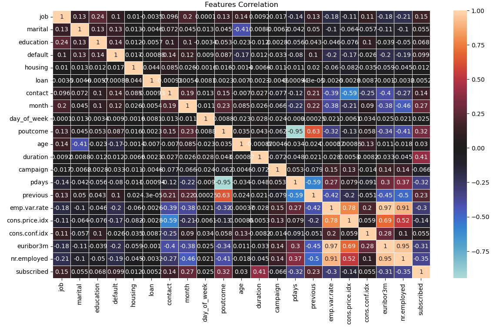

There are several characteristics with a high correlation ('emp.var.rate', 'cons.price.idx', 'nr.employed')

<ins>Imbalance</ins>

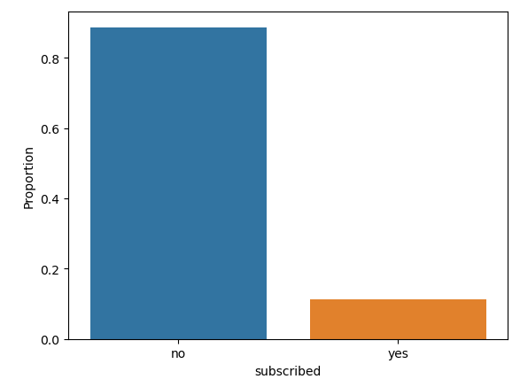

As can be seen, the target variable is very unbalanced, which may affect the predictions.

### Baseline Model ###

For the training I used 4 different models in order to find the most optimal one (A dummy classifier will be used as a baseline reference model):

* Logistic Regression
* KNN
* Decision Tree
* SVM

Note: I use the default settings for each of the models

Note 2: Only 7 features were used

### Baseline Model Evaluation ###

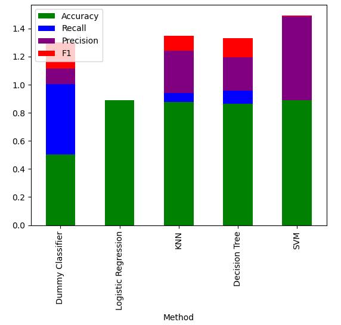

These results show that the best method for this specific dataset is Decision Tree since it has a good training time and in addition to a good accuracy(not the highest but close) it also has the highest F1 score. These models using only 7 characteristics are not ideal for prediction, they are too close to the base model (Dummy Classifier), it is notorious that it is necessary to add more characteristics to them.

### Improved Model ###

In the correlation analysis some features were eliminated which had a high correlation between them, among those eliminated are the following:

* emp.var.rate
* cons.price.idx
* nr.employed

In addition, the duration feature has also been removed, since as the column instructions indicate, this feature is set to zero before contacting a customer and it does not make sense to use it as a prediction feature.

We add the other features that we omitted in the previous point except for those mentioned in the previous paragraph.

Now to perform a deeper analysis we will use GridSearchCV and HalvingRandomSearchCV to find the best parameters for each method.

For the training I used 7 different models in order to find the most optimal one

* Logistic Regression with GridSearchCV
* KNN with GridSearchCV
* Decision Tree with GridSearchCV
* SVM Polynomial Kernel with HalvingRandomSearchCV
* LinearSVC
* SGDClassifier with GridSearchCV
* Decision Tree with GridSearchCV and Oversampling

### Improved Model Evaluation and Findings ###

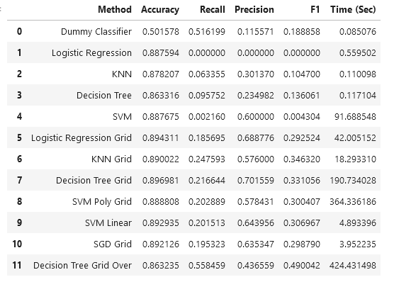

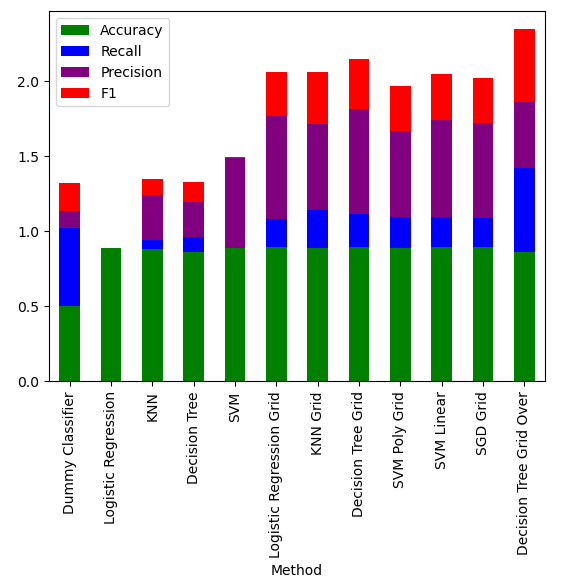

As we can see after training several models with different parameters and different search techniques, Decision Tree together with ADASYN allows us to obtain a model with a higher f1 score than the others as well as an acceptable recall to handle false negatives.

Decision tree using adasyn is the model with the highest F1 and recall value, a high recall means that the model correctly identifies most of the subscribers (minimizing false negatives). This is crucial if the cost of not identifying a subscriber is high. For example, if each subscribed user represents an important business opportunity, losing a subscriber due to a false negative can be very costly.

### Feature Importances

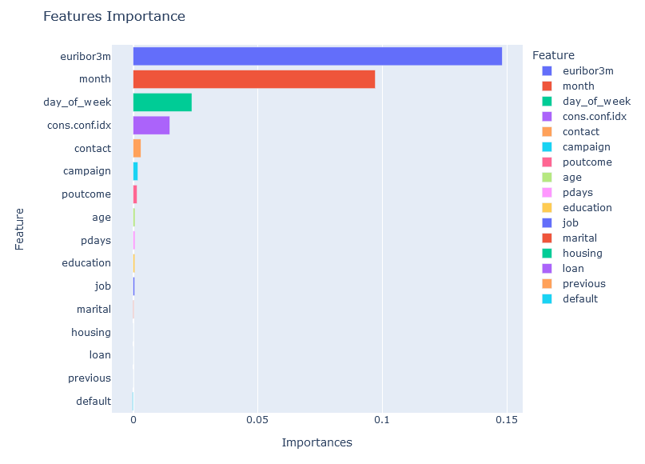

As we can see Euribor is the feature that most influences a customer's acceptance of whether or not to sign up for a deposit, it is not surprising that this feature is above all others because if Euribor rises, reflecting a higher interest rate environment, it is very likely that banks will be able to increase interest rates on savings accounts to make them more attractive to depositors. This is especially true if banks rely heavily on customer deposits for funding, but, as a very important point to keep in mind, when interest rates are low, returns on other financial investments (such as bonds and time deposits) also tend to be low. In this environment, people may choose to open savings accounts as a low-risk strategy, protecting their capital while waiting for better investment opportunities.

The month and day are other characteristics that influence the decision to open a deposit or not, which is something to take into account because depending on the month and day it is very likely that customers will be more willing to open an account.

The consumer confidence index (cons.conf.idx) measures the degree of optimism consumers feel about the general state of the economy and their personal financial situation. This index can have a significant influence on individual's financial decisions, including the opening of savings accounts at a bank.

And what would be the reason?

When the consumer confidence index is high, consumers feel more confident about their future financial situation. This may lead them to feel less inclined to save cautiously and instead spend more on consumption and investments. That can create a high confidence environment, if the economy is expanding, banks may offer higher interest rates on savings accounts to attract more deposits and fund additional loans.

In contrast, if the consumer confidence index is low, consumers may be more concerned about economic uncertainty and, therefore, more inclined to save money to protect against possible future financial difficulties. This may result in an increase in the opening of savings accounts.

### Features Analysis

#### Average Euribor Value by Subscribed Target

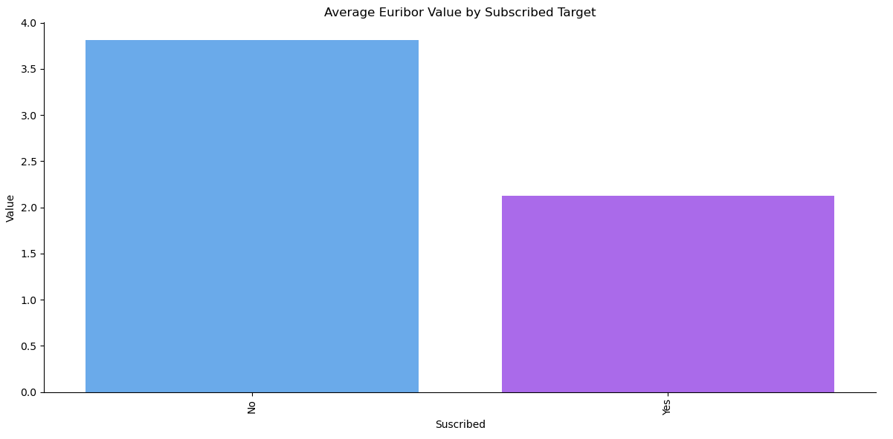

This graph shows that the Euribor has a very important influence on the prediction of whether or not a client accepts to subscribe to a bank account. As can be seen the average Euribor is higher in customers who did not accept the deposit while in customers who did accept the deposit the Euribor is lower, so the conclusion here is that when the Euribor has a low value it is the best time to promote the bank's deposit accounts.

Banks may offer additional incentives to open savings accounts when Euribor is low. This may include account opening bonuses, promotional interest rates or additional services. These incentives may entice people to open new savings accounts.

#### Acceptance Rate By Month

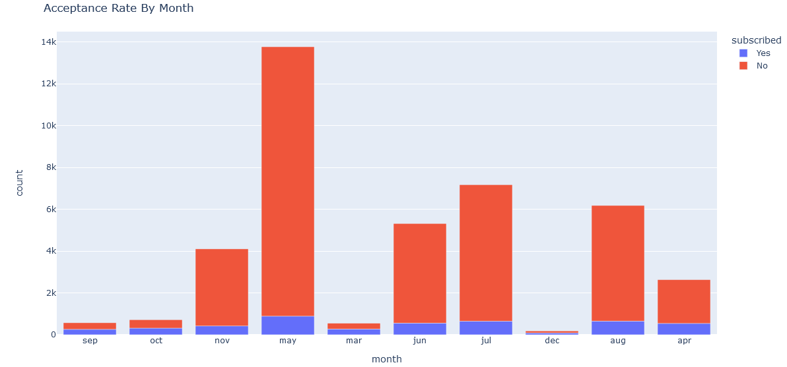

As we can see some months have a higher activity than others in terms of customer contact (months like June or July), especially the month of May, but even though it was a month with the highest acceptance of customers to open a bank account, it has a much higher rejection rate than other months, while for example months like March, October or September are months with a more 50/50 rate and even though there are fewer calls and fewer subscribers accepting the deposit, it is a month that could present an opportunity to improve that positive acceptance with a lower rejection rate.

This is probably because May, June or July in Europe are summer months and people would rather spend their money on vacation than on saving. With the exception of December which is a somewhat special month, some months are more likely to improve the acceptance of subscribing to a bank account if the above is taken into account.

#### Acceptance Rate By Day of Week

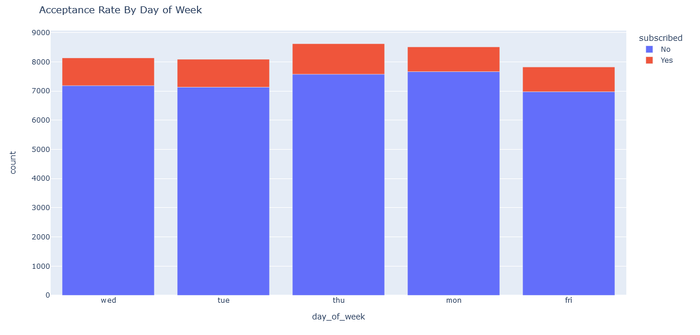

Although the data per day of the week are very similar, it is possible to rescue that Thursday has a slightly higher acceptance rate than the others, being Monday and Friday the ones with less acceptance, it is advisable that the calls can be made better on Wednesday and Thursday in order to improve the acceptance rate.

#### Acceptance Rate By Education

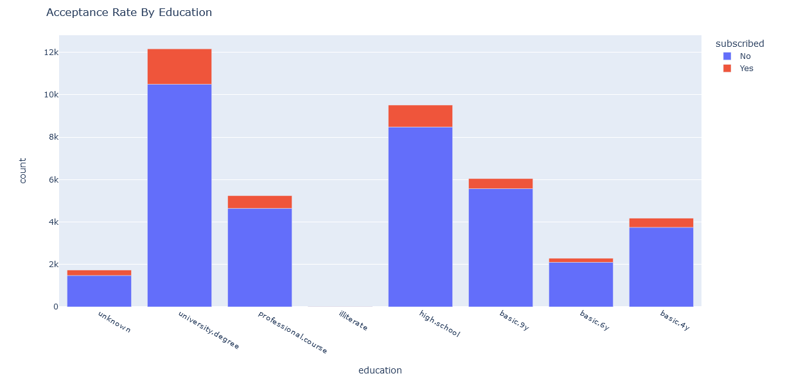

Keep in mind that the highest acceptance comes from people with a university degree and similar. 

#### Acceptance Rate By Marital Status

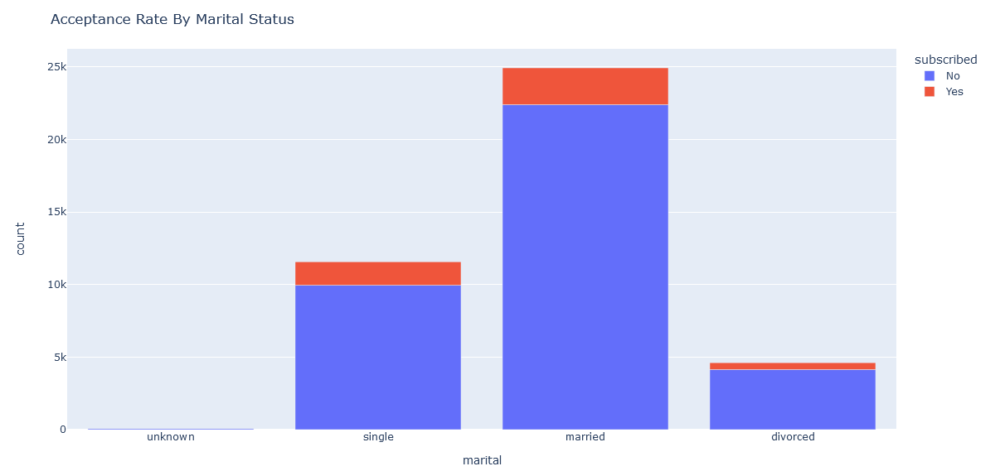

Married is the marital status most likely to accept subscription followed by single.

### Next steps and recommendations

1. One way to improve this model is to perform an update of the data and increase the number of records to try to train a neural network to see if this type of model would improve prediction.

2. It is more fruitful to offer bank account subscription services to people with higher levels of education.

3. The Euribor is a very important feature to take into account, if interest rates go down it is the right time to carry out a campaign.

4. Targeting people with a single or married marital status yields better results than targeting people with unknown or divorced marital status.

5. It is more viable to offer banking and deposit services when the consumer confidence index is low.
